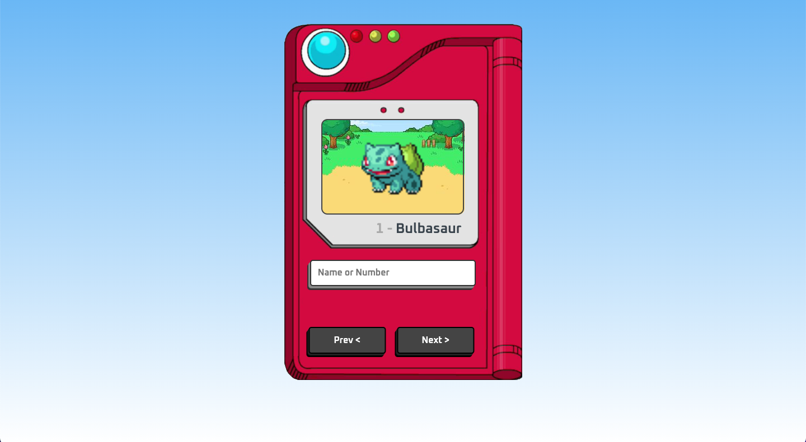

# App Pokedex

A pokédex simulation written in JS!

## 🔨 Project features

A very responsive pokedex that allows you to browse all generation 5 pokemons.

A Pokedex is an electronic device featured in the Pokémon game and anime series that serves as a digital encyclopedia for all known Pokémon species. It contains detailed information about each Pokémon, such as its name, number in order of registration, type, abilities, battle stats, possible evolutions, location where it can be found, and other characteristics.

The [Tutorial of this application you can find here](https://www.youtube.com/watch?v=SjtdH3dWLa8&ab_channel=ManualdoDev).

## ✔️ Techniques and technologies used

Check out this list of everything we will use in this app:

- `Responsiveness`
- `JavaScript`
- `HTML 5`
- `CSS 3`
- `BEM Methodology`
- `Conditional Rendering`
- `AWS Deployment`
- `GitHub`

## 🛠️ Open and run the project

To open and run the project, add the Live Server extension, click on the Go Live button usually located in the lower right corner if you are using vscode.

Then go to <a href="http://127.0.0.1:5500/">http://127.0.0.1:5500/</a> in your browser.

## 📚 More tutorial information

App Pokedex is an application for pokemons consultation, developed from the tutorial [Manual do Dev](https://www.youtube.com/@ManualdoDev). The main idea behind the implementation of this tutorial is to further evolve pure knowledge in js, html and css bases. It is a project that I highly recommend running.
